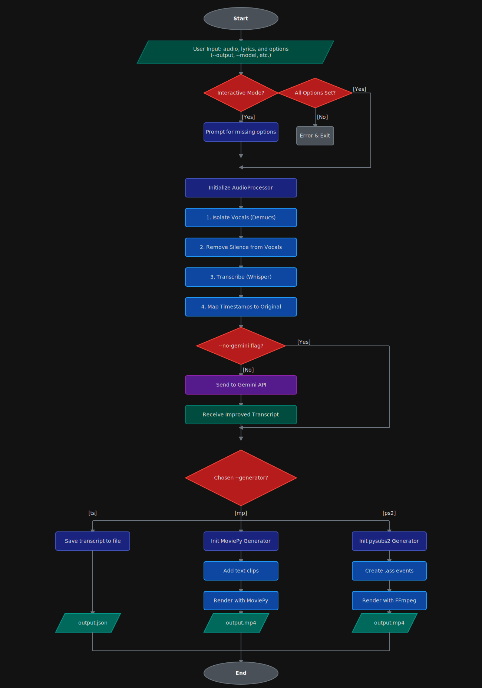

<div align="left">
  <a href="https://shipwrecked.hackclub.com/?t=ghrm" target="_blank">
    
  </a>
</div>

# Lyriks

Lyriks is an automated lyrics video generator. It transcribes audio and automatically creates a lyrics video using fast subtitle rendering (pysubs2+ffmpeg) or MoviePy.

---

## Features

- **Automatic vocal separation** using [Demucs](https://github.com/facebookresearch/demucs)
- **Transcription** with [OpenAI Whisper](https://github.com/openai/whisper) and [whisper-timestamped](https://github.com/linto-ai/whisper-timestamped)
- **Fast, high-quality video rendering** with pysubs2 + FFmpeg
- **Synchronized lyrics video** generation with [MoviePy](https://zulko.github.io/moviepy/) (legacy)
- **ASS subtitle generation** with [pysubs2](https://github.com/tkarabela/pysubs2)
- **Fast video rendering** using [FFmpeg](https://ffmpeg.org/)

---

## Requirements

- Linux (Windows support is experimental; macOS hasn't been tested yet)
- An NVIDIA GPU (recommended for best performance; CPU is supported but slower)
- 10GB of free disk space
- Python 3.11
- ffmpeg

### Installing FFmpeg

On **Ubuntu/Debian**:
```bash
sudo apt update
sudo apt install ffmpeg
```

On **Arch Linux**:
```bash
sudo pacman -S ffmpeg
```

For other platforms and more details, see the [FFmpeg download page](https://ffmpeg.org/download.html).

---

## Installation

It is highly recommended to use a virtual environment for isolation:

```bash
python3 -m venv .venv
source .venv/bin/activate
```

Then install Lyriks with pip:

```bash
pip install lyriks-video
```

---

## Usage

```bash
python -m lyriks generate AUDIO_FILE LYRICS_FILE [OPTIONS]
```

### Parameters

- **AUDIO_FILE**  
  Path to the input audio file (e.g., `song.mp3`).  
  This should be a supported audio format (such as MP3 or WAV).

- **LYRICS_FILE**  
  Path to the lyrics file (plain text).  
  The lyrics should be in a text file, one line per lyric segment.

### Options

You will be interactively prompted in the CLI for any options you leave unspecified.

- `--output`, `-o`  
  Output video file name (without extension).  
  *Example:* `-o my_lyrics_video`

- `--model_size`, `-m`  
  Sets the Whisper model size for transcription.  
  *Options:* `tiny`, `base`, `small`, `medium`, `large`, `turbo`  

- `--device`, `-d`  
  Which device to use for Whisper model inference.  
  *Options:* `cpu`, `cuda`  

- `--generator`, `-g`  
  Which backend to use for video generation.  
  *Options:*
    - `ps2`: pysubs2 + ffmpeg (fast, good quality, experimental, ~60 fps)
    - `mp`: MoviePy (slow, low quality, legacy, ~10 fps)
    - `ts`: Only save transcript (for debugging)

- `--background`, `-b`  
  Optional background **video** file for the video (must be a video the same length or longer than the audio).  
  *Example:* `-b my_background.mp4`

- `--no-gemini`  
  Disable Gemini improvements for Whisper output.  

- `--karaoke`, `-k`  
  Generate a karaoke-style video (music only, vocals removed).  
  When this option is enabled, Lyriks will automatically separate the vocals from the music using Demucs and use the instrumental (music without vocals) as the audio track for the generated video.

---

### Example

```bash
python -m lyriks generate path/to/song.mp3 path/to/lyrics.txt -m small -d cuda -o output_video -b background.mp4
```

Note: This process can take up to 5 minutes on lower end hardware.

---

## TODO

- Libary of procedually generated backgrounds
- Batch processing
- Automatic upload to YouTube
- Config file for video style
- Config file generator function

---

## How Lyriks Works

<p align="center">
  
</p>

---

## Credits

This project uses:
- [Demucs](https://github.com/facebookresearch/demucs) for music vocal separation.
- [whisper-timestamped](https://github.com/linto-ai/whisper-timestamped) for word-level timestamped transcription.

---

## Citations

If you use this in your research, please cite the following:

### Demucs

```bibtex
@inproceedings{rouard2022hybrid,
  title={Hybrid Transformers for Music Source Separation},
  author={Rouard, Simon and Massa, Francisco and D{'e}fossez, Alexandre},
  booktitle={ICASSP 23},
  year={2023}
}

@inproceedings{defossez2021hybrid,
  title={Hybrid Spectrogram and Waveform Source Separation},
  author={D{'e}fossez, Alexandre},
  booktitle={Proceedings of the ISMIR 2021 Workshop on Music Source Separation},
  year={2021}
}
```

### whisper-timestamped

```bibtex
@misc{lintoai2023whispertimestamped,
  title={whisper-timestamped},
  author={Louradour, J{\'e}r{\^o}me},
  journal={GitHub repository},
  year={2023},
  publisher={GitHub},
  howpublished = {\url{https://github.com/linto-ai/whisper-timestamped}}
}
```

### OpenAI Whisper

```bibtex
@article{radford2022robust,
  title={Robust speech recognition via large-scale weak supervision},
  author={Radford, Alec and Kim, Jong Wook and Xu, Tao and Brockman, Greg and McLeavey, Christine and Sutskever, Ilya},
  journal={arXiv preprint arXiv:2212.04356},
  year={2022}
}
```

### Dynamic-Time-Warping

```bibtex
@article{JSSv031i07,
  title={Computing and Visualizing Dynamic Time Warping Alignments in R: The dtw Package},
  author={Giorgino, Toni},
  journal={Journal of Statistical Software},
  year={2009},
  volume={31},
  number={7},
  doi={10.18637/jss.v031.i07}
}
```

---

## License

This project is licensed under the [GPL-3.0 License](https://www.gnu.org/licenses/gpl-3.0.html).

---

## Contributing

Contributions are welcome!  
If you have suggestions, bug reports, or want to add features, please open an issue or submit a pull request.

1. Fork the repository
2. Create your feature branch (`git checkout -b feature/my-feature`)
3. Commit your changes (`git commit -am 'Add new feature'`)
4. Push to the branch (`git push origin feature/my-feature`)
5. Open a pull request

---

## Contact

For questions, bug reports, or feedback, please open an [issue on GitHub](https://github.com/simon0302010/Lyriks/issues)  
or contact the maintainer: **simon0302010** (GitHub username).

---
